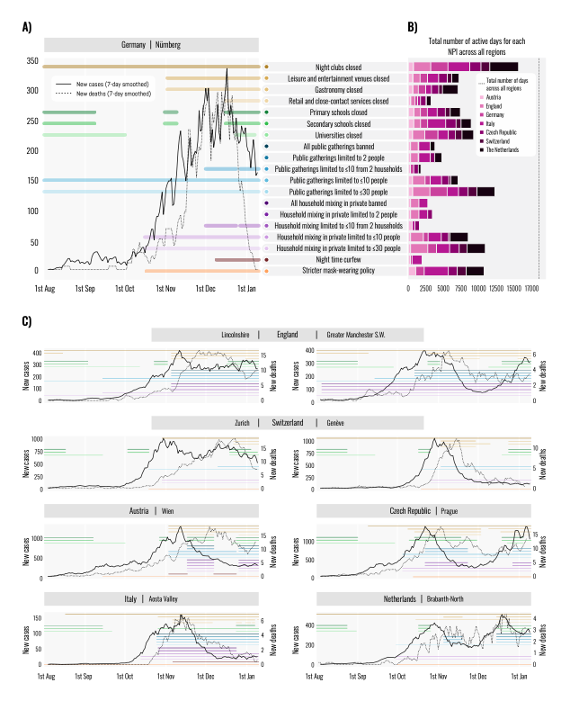
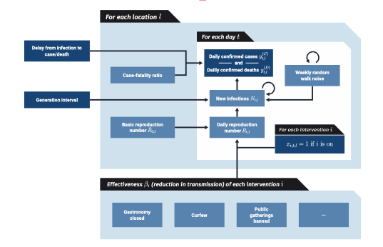
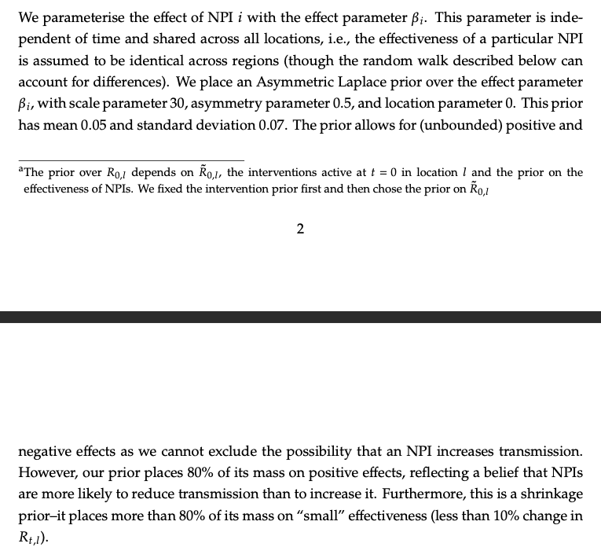
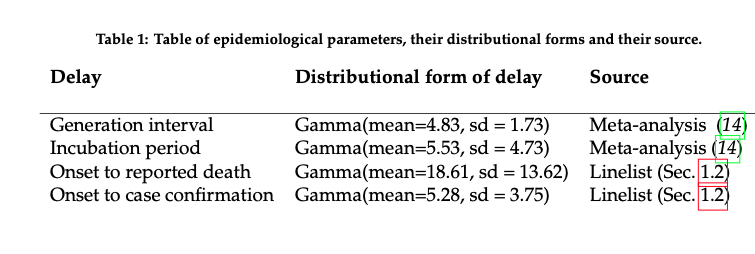

# Understanding the effectiveness of government interventions in Europe’s second wave of COVID-19

---

### Abstract

---

#### Aim

Update estimates of the relative effectiveness of NPIs based on data from Europe's second wave (a joint collaboration between the Brauner and flaxman teams).

---

#### Methods 

- Collect a large dataset of NPI implementations (114 subnational areas in 7 countries)

- Estimate the effectiveness of 17 NPIs from case and deaths data using a hierarchical regression model with the renewal equation and convolutions from infection to report as novel link functions. 

- Address limitations in modeling from previous studies

---

#### Results
 
- Similar to previous findings.
- Targeted closure of business worked well.
- Reduced impact from school closures

---

#### Summary

- A well conducted study that draws on a large team to conduct novel work in a robust framework.

- Major improvement is in the quality of the data rather than the method.

- The nature of the observational data is highly complex and many of these issues have been insufficiently dealt with.
 
---

### Introduction

--- 

#### Previous work

- Earlier studies used data based on NPI introductions in a very short time window in March 2020. 

- Nearly all countries and regions imposed the same NPIs in the same order.

- Numerous data quality issues and varying testing/reporting regimes in the first wave.

- Lack of subnational data may have induced ecological fallacies.

---

  #### This work

 - Bespoke data categorisation

 - Latent stochastic infection model (fancy regression)

 - Robust evaluation of assumptions

 - 1st August to 9th January 2021

 - 7 countries with 114 regions of analysis

---

---

# Results 

---

#### First vs second wave

- Pairwise 6969 days on average with on NPI and not the other with minimum of 635 region days

- NPIs reduced Rt by 66% [95% CI: 61%-69%] vs 77%-82%

- The most stringent set reduced Rt by  56% [95% CI: 40%-64%] vs 76%-82%

---

#### Effect estimates

- Lockdown effect: 52% [95% CI: 47-56%]

- Stricter mask-wearing policy (mandatory in most or all shared/public spaces) and a night time curfew had moderate, but statistically significant effects [12%, 95% CI: 7-17%] and [13%, 6-20%])
---

---

#### Estimate of robustness

- 17 sensitivity analyses

- Stability of unobserved effects (unrecorded NPIs, changes to ascertainment and fatality rates)

- Sensitivity analysis in SI is made up of lots of graphs, investigate in your own time.

---

---

### Conclusions

---

#### Summary

- Estimates can be used to inform reopening

- First such estimates

---

#### Limitations

- We don't know the impact of voluntary safety measures or variants

- No effectiveness estimate can apply to all regions.

---

### Methods

---

#### Summary

- Lots of details about NPI collection - looks robust. 

- Model: Nothing, all in supplement. 

---

### Code

https://github.com/MrinankSharma/COVID19NPISecondWave

*TLDR: it is pretty nice python*

---

# Model

---
### Summary

- Fixed effects NPI regression model with a 7 day random walk.

- Fixed generation time renewal equation based model to estimate infections

- Fixed delays to death and report 

- IFR fit by location but fixed  in time (explored UK varying IRFs taken from the imperial dashboard as a sensitivity)

---

### Summary

- Country specific overdispersion in the negative binomial observation model.

- Implemented in NumPyro using NUTS MCMC.

- McAloon incubation period

- Linelist data from Austria, Germany, and UK for report delay.

---

---

---

---

*walk prior appears to be shared in time and space*

---

---

