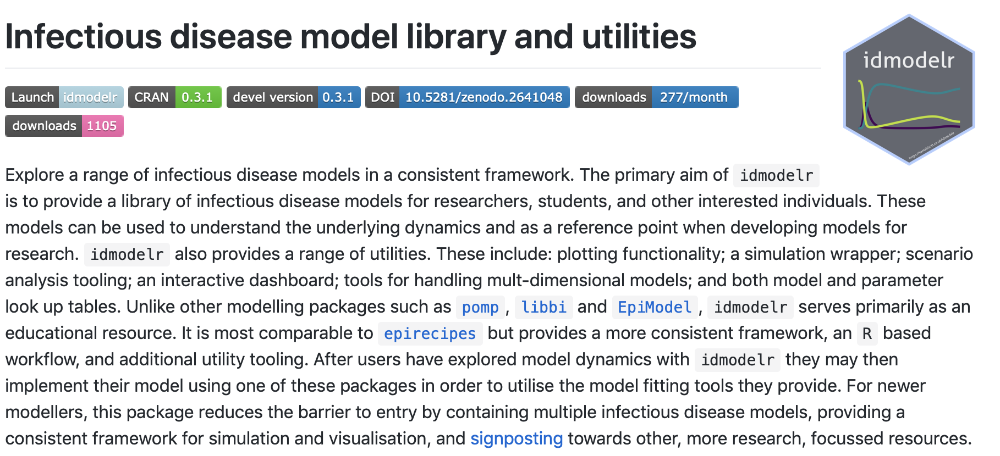

class: inverse

```{r setup, include=FALSE}
options(htmltools.dir.version = FALSE)

knitr::opts_chunk$set(echo = TRUE, dpi = 330, fig.align = 'center', dev = 'svg', eval = TRUE)
```


# Outline

## 1. Me

## 2. My work

## 3. Why am I applying for the SSI fellowship

## 4. What would I do with it

---
class: center, middle, inverse

# Who am I?
---

# Background

* Postdoctoral researcher in infectious disease dynamics.<sup>1</sup>

* PhD: Modelling tuberculosis and the optimal usage of the BCG vaccination.<sup>2</sup>

* Previously: Mathematics, theoretical physics, applied mathematics, and data science in finance. 

* Currently: Modelling zoonotic tuberculosis burden and actively looking for new research ideas/funding.

.footnote[
[1] More detail here: [https://www.samabbott.co.uk](https://www.samabbott.co.uk/)
[1] Thesis (in bookdown): [bit.ly/seabbs-thesis](http://bit.ly/seabbs-thesis)
] 
---

# Interests

* Infectious disease dynamics.

* Improving infectious disease modelling practice and scientific workflow more generally.

* Informing policy and enabling others to do so in a more robust manner. 

* Engaging the wider community with science and actively involving them where possible.

* Next section for more.

---
class: center, middle, inverse

# What do I do?

---

# Statistical and mathematical modelling<sup>1</sup>


```{r echo = FALSE, out.width = "85%"}
knitr::include_graphics("img/publications.png")
```


.footnote[
[1] [samabbott.co.uk/#publications](https://www.samabbott.co.uk/#publications)
]

---

# Software: `{getTBinR}`<sup>1, 2, 3</sup>

```{r, echo = FALSE, fig.height = 5}
knitr::include_graphics("img/getTBinR.png")
```

.footnote[
[1] Package Docs: [bit.ly/getTBinR](https://bit.ly/getTBinR), 
[2] JOSS paper: [bit.ly/getTBinR-paper](http://bit.ly/getTBinR-paper)
[3] Blog: [github.com/seabbs/hpru-blog-post-getTBinR](https://github.com/seabbs/hpru-blog-post-getTBinR)
]
---

# Software: `{idmodelr}`<sup>1</sup>  

```{r echo = FALSE, fig.height = 5}

```

.footnote[
[1] `{idmodelr}`: [bit.ly/idmodelr](https://bit.ly/idmodelr)
]
---
class: center, middle, inverse

# What would I do with the fellowship?

---

# Raising the profile of software > code > papers


* Infectious disease modelling community has varying levels of reproducibility, code quality and software development.

* Code is often not shared at all. 

* Even if researchers have the best intentions code can be difficult to use.

* There maybe little documentation, no testing, and no long term support.

* Keen to form a community of best practice for infectious disease modellers. Most often it is not about not wanting to produce reusable code but about not knowing how. 

* Often there is little acknowledgement of efforts to be reproducible and develop software (reviewers frequently do not look at code). Recognition from the SSI would be a great way of acknowledging the value of this input. 

---

# Running a hackathon for infectious disesase modelling tool development

* Soon to be attending a health economics hackathon that aims to teach the community about software best practices and also develop tools with the input of domain experts. 

* Would like to replicate this for infectious disease modelling.

* Key aim would be to build out the community around `{idmodelr}` but any other tooling would be treated on a equal footing. 

---

# Expanding my horizons. 

* I feel well versed in what constitutes good R software. 

* I know very little about wider best practices or best practices in other languages.

* Aim is to use this fellowship as a chance to connect with a broader community and feedback my findings to infectious disease modellers using R and the wider R community. 

---

class: inverse, center, middle

# Summary

## Slides: [bit.ly/seabbs-ssi](http://bit.ly/seabbs-ssi)

## Slide code:  [bit.ly/seabbs-ssi-code](http://bit.ly/seabbs-ssi-code)

## Tweet at me: [@seabbs](https://twitter.com/seabbs)


