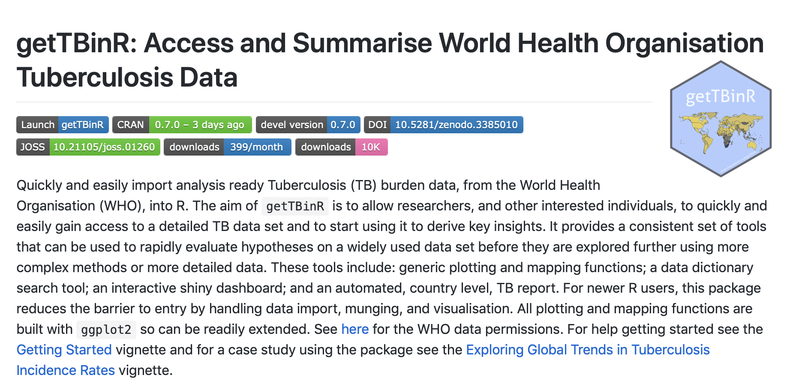

class: inverse

```{r setup, include=FALSE}
options(htmltools.dir.version = FALSE)

knitr::opts_chunk$set(echo = TRUE, dpi = 330, fig.align = 'center', dev = 'svg', eval = FALSE)
```


# Outline

## 1. Who am I?

## 2. What do I do?

## 3. What would I do with the fellowship?

## 4. Wrap up

---
class: center, middle, inverse

# Who am I?

---

# Background


---

# Interests

---

---
class: center, middle, inverse

# What do I do?

---

# Overview

* Postdoctoral researcher (as of September `r emo::ji('fireworks')`) in infectious disease modelling
* Focussing on policy relevent modelling of Tuberculosis and BCG vaccination.

---

# `{getTBinR}`<sup>1, 2</sup>

```{r, echo = FALSE, fig.height = 5}

```

.footnote[
[1] Package Docs: [bit.ly/getTBinR](https://bit.ly/getTBinR), 
[2] JOSS paper: [bit.ly/getTBinR-paper](http://bit.ly/getTBinR-paper)
]
---

# `{idmodelr}`<sup>1</sup>  

```{r echo = FALSE, fig.height = 5}
knitr::include_graphics("img/idmodelr.png")
```

.footnote[
[1] `{idmodelr}`: [bit.ly/idmodelr](http://bit.ly/idmodelr)
]

---

# PhD Focus: Tuberculosis

* Tuberculosis (TB) is one of the oldest human diseases, with recorded cases in ancient Egypt, renaissance Europe, and in the modern day across the globe.

* It is thought to infect over 1.7 billion people globally, of which 5-15% will develop symptomatic TB in their lifetime (World Health Organisation 2018).

* Of this number around 10% are likely to die from TB or TB related causes and globally TB remains the leading cause of death from infectious disease. 

* TB is preventable and curable, but the majority of cases occur in less economically developed countries and are never diagnosed. 

.footnote[
[1] Source: https://github.com/seabbs/hpru-blog-post-getTBinR,
[2] Thesis (in bookdown): http://bit.ly/seabbs-thesis
] 
---

```{r echo = FALSE}
knitr::include_graphics("img/pathwork-storyboard-1.png")
```

---

# Co-organiser of BristolR and speaker

```{r, out.width = "90%", echo = FALSE}
knitr::include_graphics("img/myessentialr.png")
```

.footnote[
[1] Slides: http://bit.ly/MyEssentialR
]

---
# Blogging on #rstats, modelling etc.<sup>1</sup>

```{r blog-img, out.width = "80%", echo = FALSE}
knitr::include_graphics("img/blog.png")
```


.footnote[
[1] See them here: https://www.samabbott.co.uk/post/
]

---

# #rstats twitter<sup>1</sup> 


```{r gists-img-2, out.width = "85%", echo = FALSE}
knitr::include_graphics("img/twitter.png")
```

.footnote[
[1] Twitter: https://twitter.com/seabbs
]

---
class: center, middle, inverse

#  Summary (1 minute)

---

# Who am I?
 
 * Postdoctoral researcher in infectious disease modelling.
 
 * Background in epidemiology, mathematics, applied mathematics and theoretical physics.
 
 * Previously data scientist
 
 * Passionate about open science + open source software. 

---

# What do I do?

* Researching how to improve interventions against infectious disease.

* Focus on reproducibility and tool making.

* Author of two CRAN packages + several others still on GitHub.

* Reviewer at JOSS. 

* Active blogger/tweeter on #rstats, open science and infectious diseases.

---

## What would I do with the fellowship?

* Raising the profile of my open source work and promoting it (and open source software more generally) in the infectious disease modelling community.

* Running a hackathon to engage infectious disease modellers with open source tool development (`{idmodelr}` and beyond).

* Broadening my knowledge of the open source community beyond #rstats (SSI collab workshop etc.).

---

class: inverse, center, middle

# Thanks for watching!

## Slides: http://bit.ly/MyEssentialR

## Use my stuff: github.com/seabbs

## Read  my stuff: samabbott.co.uk

## Tweet at me: @seabbs


