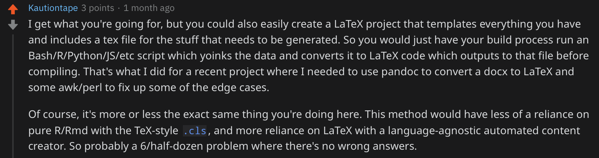

class: inverse

```{r setup, include=FALSE}
options(htmltools.dir.version = FALSE)

knitr::opts_chunk$set(echo = TRUE, dpi = 330, fig.align = 'center', dev = 'svg', eval = TRUE)
```
class: center, middle, inverse


# Slides: [bit.ly/seabbs-CVinR](http://bit.ly/seabbs-CVinR)
---
class: inverse

## 1. Who am I?

## 2. What are we looking for?

## 3. Alternatives to R

## 4. Options in R

## 5. Added benefits

## 6. Examples

## 7. Summary

---
class: center, middle, inverse

# Who am I?
---

# Who am I?

* **Postdoctoral researcher:** Infectious disease dynamics.<sup>1</sup>

* **PhD:** Modelling tuberculosis and the optimal usage of the BCG vaccination.<sup>2</sup>

* **Previously:** Mathematics, theoretical physics, applied mathematics, and data science in finance.

* **Sideline:** Open source software, reproducibilty + hounding people on the internet about reproducibility.

* **Currently:** Modelling zoonotic tuberculosis burden + job hunting.

.footnote[
[1] More detail here: [https://www.samabbott.co.uk](https://www.samabbott.co.uk/)

[1] Thesis (in bookdown): [bit.ly/seabbs-thesis](http://bit.ly/seabbs-thesis)
] 

---
class: center, middle, inverse

# What are we looking for?

---

# What are we looking for?

### 1. Impressive.


### 2. Easy to make.


### 3. Easy to update. 


---
class: center, middle, inverse

# Alternatives to R

---

# Word

## Pros

* Everyone likely knows how to use it
* Some automation maybe possible using plug-ins? 

## Cons

* Can be hard to format documents well.
* May be difficult to update.
* Likely to break at random.
* Customisation.
* Automation.
* Closed source.
* It isn't very cool.

**I think we all know the answer is no... **

---

# LaTex

## Pros

* Creates beautiful documents.
* Extensively customisable.
* Open source.
* Automation available via scripting.

## Cons

* Relatively high barrier to entry (for me).
* Hard to read in its raw form (for me).
* Updating may be tedious (for me).
* Maintaining a LaTex install can be annoying (for me) - time to use `tinytex`.
* Only a little cool - we didn't all do maths/science degrees.

---

# Automating Latex

```{r, echo = FALSE, fig.height = 5}

```

.footnote[
[1] [Reddit thread](https://www.reddit.com/r/rstats/comments/dc7xn9/cv_made_with_rstats_vitea_and_scholar_automatic/f27v7eh?utm_source=share&utm_medium=web2x)

] 

---

# Other options


* Python (any suggested examples?)

* Other literate programming tools?

* Straight HTML

* Straight Markdown

* Other ideas?

---

class: center, middle, inverse

# Options in R

---

# Overview

### [`{Rmarkdown}`](https://rmarkdown.rstudio.com)

Write R code and text -> document $+$ a customised `.tex` or `.css` template.

### [`{vitea}`](https://pkg.mitchelloharawild.com/vitae/) + [`{Rmarkdown}`](https://rmarkdown.rstudio.com)

LaTeX templates, with helpful functions to add content to the documents.

### [`{pagedown}`](https://github.com/rstudio/pagedown) + [`{Rmarkdown}`](https://rmarkdown.rstudio.com)

Paginate the HTML Output of R Markdown with CSS for Print. No need to install LaTeX to get beautiful PDFs.

---
class: center, middle, inverse

# Added benefits

---

# Benefits

* Easy to read as near plain text.

* All the power of Latex or CSS with a much lower barrier to entry.

* Easy to update - updates can be to text files (i.e. .`csv`'s) that are then pulled into R.

* Access to all other R tooling.

* Automation.

* People will think you are cool (well I will).
---

# Automation

### [`{tinytex}`](https://github.com/yihui/tinytex)

### [`{scholar}`](https://github.com/jkeirstead/scholar)

### [`{tic}`](https://github.com/ropenscilabs/tic.website)

### [`{rorcid}`](https://github.com/ropensci/rorcid)

### Other

* Logic to generated different CV types for different jobs

* Pull in GitHub projects and commit histories

* Sync with LinkedIn?

---
class: center, middle, inverse

# Examples

---

# Example: My academic CV

## Aims

* Make CV generation less of a chore (I eventually became scared of my previous LaTex CV).

* Basic changes should be possible using plain text without any technical tools. 

* Update papers without user intervention.

* Relatively hands-off on formatting as I don't really care.

* Split formatting from content.

---

# Example: My academic CV

## What did I end up with?

* `{Rmarkdown}` document that contains the key sections and relatively static information.

* Off the shelf template with no alterations.

* Automated build and deployment on [Travis CI](https://travis-ci.org).

* Content updates possible via plain text file changes on GitHub.

* Papers pulled in from my curated [Google Scholar](https://scholar.google.co.uk/citations?hl=en&user=GqZm90IAAAAJ) profile.
---

# Example: My academic CV

## Tools

* `{Rmarkdown}`

* `{vitea}`

* `{tinytex}`

* `{tic}`

* `{scholar}`

* `{tidyverse}`

---

# Example: My academic CV

## Final product

See here: [bit.ly/seabbs-cv](http://bit.ly/seabbs-cv)

## Code

See here: [github.com/seabbs/cv](https://github.com/seabbs/cv)


---


# Example: [Nic Strayer's CV](http://nickstrayer.me)

### Implemented using

* `{pagedown}`, custom CSS, and `{Rmarkdown}`.

### Features 

* HTML/PDF output, awesome formatting, data read in + filtered from a `.csv`, logic for paged/unpaged output, and a long or short form.


### Links

* [Final product (long)](https://github.com/nstrayer/cv/blob/master/strayer_cv.pdf)/[Final product (short)](https://github.com/nstrayer/cv/blob/master/strayer_resume.pdf).

* [Code](https://github.com/nstrayer/cv).

* [Blog post walkthrough](https://livefreeordichotomize.com/2019/09/04/building_a_data_driven_cv_with_r/).

---

# Other examples


* Check out the [`{vitea}`](https://pkg.mitchelloharawild.com/vitae/) documentation for a list of examples using [`{vitea}`](https://pkg.mitchelloharawild.com/vitae/).


* Similary, check out the [`{pagedown}`](https://github.com/rstudio/pagedown) documentation for examples using [`{pagedown}`](https://github.com/rstudio/pagedown).

* Any more ideas?

---

class: center, middle, inverse

#Summary

---

# Summary

* Other options exist but for R users R offers a nice balance of ease of use and customisation. 

* Essentially combining `{Rmarkdown}` with a template package. 

* Once implemented in R any other package can be used with ease. 

* This allows: automated updates, data read from plain text, paper syncing from google scholar, 
profile syncing from ORCID, project updates from GitHub, and many many other things!!

* See the links for more info and feel free to contact me with any questions.

---
class: center, middle, inverse

# Advertising
---

# Software: `{getTBinR}`<sup>1, 2, 3</sup>

```{r, echo = FALSE, fig.height = 5}
knitr::include_graphics("img/getTBinR.png")
```

.footnote[
[1] Package Docs: [bit.ly/getTBinR](https://bit.ly/getTBinR), 
[2] JOSS paper: [bit.ly/getTBinR-paper](http://bit.ly/getTBinR-paper)
[3] Blog: [github.com/seabbs/hpru-blog-post-getTBinR](https://github.com/seabbs/hpru-blog-post-getTBinR)
]
---

# Software: `{idmodelr}`<sup>1</sup>  

```{r echo = FALSE, fig.height = 5}
knitr::include_graphics("img/idmodelr.png")
```

.footnote[
[1] `{idmodelr}`: [bit.ly/idmodelr](https://bit.ly/idmodelr)
]

---

# Presentations

```{r echo = FALSE, out.width = "75%"}
knitr::include_graphics("img/talks.png")
```

.footnote[
[1] [samabbott.co.uk/talk/](https://www.samabbott.co.uk/talk/)
[2] [cardiff2019.satrdays.org](https://cardiff2019.satrdays.org)
]

---

# Blogging on R, modelling, software, etc.<sup>1</sup>

```{r blog-img, out.width = "80%", echo = FALSE}
knitr::include_graphics("img/blog.png")
```

.footnote[
[1] [samabbott.co.uk/post/](https://www.samabbott.co.uk/post/)
]

---

class: inverse, center, middle

# Thanks for listening!

## Slides: [bit.ly/seabbs-CVinR](http://bit.ly/seabbs-CVinR)

## Slide code:  [bit.ly/seabbs-CVinR-code](http://bit.ly/seabbs-CVinR-code)

## Use my stuff: [github.com/seabbs](https://www.github.com/seabbs)

## Read  my stuff: [samabbott.co.uk](https://www.samabbott.co.uk)

## Tweet at me: [@seabbs](https://twitter.com/seabbs)


