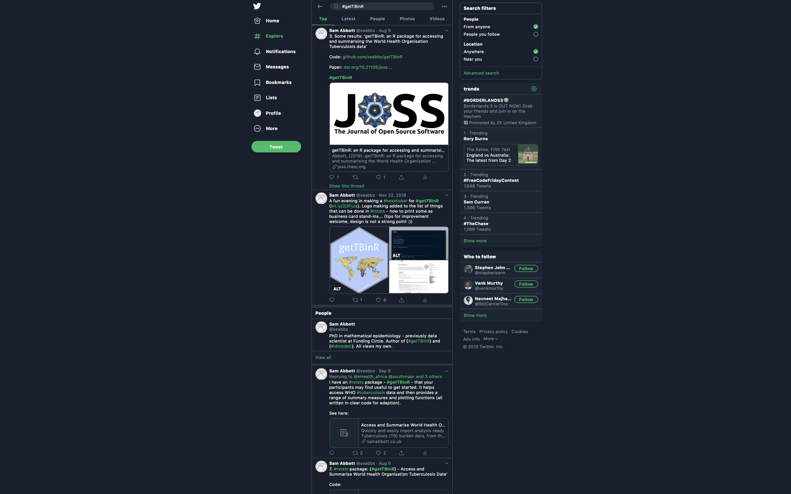

class: inverse

```{r setup, include=FALSE}
options(htmltools.dir.version = FALSE)

knitr::opts_chunk$set(echo = TRUE, dpi = 330, fig.align = 'center', dev = 'svg')

library(getTBinR)
library(tidyverse)
```


# Outline

## 1. Overview

## 2. Why

## 3. What

## 4. How

## 5. Wrap up

---
class: center, middle, inverse

# Overview

---
class: center, middle, inverse

# Slides: [bit.ly/getTBinR-r-medicine](http://bit.ly/getTBinR-r-medicine)

# `{getTBinR}`: [bit.ly/getTBinR](http://bit.ly/getTBinR)

# Dev Environment: [bit.ly/getTBinR-binder](http://bit.ly/getTBinR-binder)

---

# Overview<sup>1, 2</sup>

```{r, echo = FALSE, fig.height = 5}
knitr::include_graphics("img/overview.png")
```

.footnote[
[1] Package Docs: [bit.ly/getTBinR](https://bit.ly/getTBinR), 
[2] JOSS paper: [bit.ly/getTBinR-paper](http://bit.ly/getTBinR-paper)
]
---
class: center, middle, inverse

# Why

---

# Why data access `r emo::ji('package')`'s

* Allows multiple data sets to be combined in a consistent manner, increasing their visibility, and providing a framework for exploring key questions. 

* Tooling reduces barriers to entry, allowing non-specialists to explore data sets that would otherwise be inaccessible. 

* Widening access may lead to new insights + wider interest for key public health issues.


.footnote[
[1] Source: https://github.com/seabbs/hpru-blog-post-getTBinR
]

---

# Why Tuberculosis

* Tuberculosis (TB) is one of the oldest human diseases, with recorded cases in ancient Egypt, renaissance Europe, and in the modern day across the globe.

* It is thought to infect over 1.7 billion people globally, of which 5-15% will develop symptomatic TB in their lifetime (World Health Organisation 2018).

* Of this number around 10% are likely to die from TB or TB related causes and globally TB remains the leading cause of death from infectious disease. 

* TB is preventable and curable, but the majority of cases occur in less economically developed countries and are never diagnosed. 

* It was the focus of my PhD....<sup>2</sup>


.footnote[
[1] Source: https://github.com/seabbs/hpru-blog-post-getTBinR,
[2] Thesis (in bookdown `r emo::ji("smile")`): http://bit.ly/seabbs-thesis
]
---
class: center, middle, inverse

# What

---

# World Health Organisation TB data

* The WHO provide multiple cleaned datasets via their [website](https://www.who.int/tb/country/data/download/en/). All datasets are supported by a comprehensive data dictionary.

* Also have an API through which other datasets can be accessed but these tend to be messy. 

```{r who-data, out.width = "80%", echo = FALSE}
knitr::include_graphics("img/who-data.png")
```

---

# What data is available?

```{r what-datasets}
getTBinR::available_datasets %>% 
  dplyr::select(dataset, description)
```

---

# Get the WHO TB burden data

```{r get-tb-data}
tb_burden <- getTBinR::get_tb_burden(verbose = FALSE,
                        additional_datasets = "all")

  print(tb_burden, n = 3, n_extra = 10)
```
---

# Get the WHO TB data dictionary

```{r get-dict}
getTBinR::get_data_dict(verbose = FALSE) %>% 
  print(n = 3, n_extra = 10)
```

---

# Search for a dataset

```{r search-dataset}
getTBinR::search_data_dict(dataset = "Estimates",
                           verbose = FALSE) %>% 
  dplyr::slice(1:3) %>% 
  knitr::kable("html")
```

---

# Search for a variable

```{r search-var}
getTBinR::search_data_dict(var = "e_inc_100k",
                           verbose = FALSE) %>% 
  knitr::kable("html")
```
---

# Search within variable definitions

```{r search-def}
getTBinR::search_data_dict(def = "incidence",
                           verbose = FALSE) %>% 
  dplyr::slice(1:3) %>% 
  knitr::kable("html")
```

---

# Plot a summary

```{r summarise-tb, fig.height = 4, dev = 'svg'}
getTBinR::plot_tb_burden_summary(conf = NULL, verbose = FALSE)
```

---

# Map (`r emo::ji('map')`)

```{r map-global-inc, fig.height = 4, dev = 'svg', fig.align='center'}
getTBinR::map_tb_burden(metric = "e_inc_100k", verbose = FALSE, 
                        interactive = FALSE)
```

---

# Interactive `r emo::ji('map')`

```{r map-global-inc-int, fig.height = 4, fig.align='center', warning = FALSE, message = FALSE}
map <- getTBinR::map_tb_burden(metric = "e_inc_100k", 
                               verbose = FALSE, 
                               interactive = TRUE)
```

```{r, echo = FALSE}
htmlwidgets::saveWidget(map, paste0("map.html"), selfcontained = TRUE)
```


<iframe src="map.html" width="100%" height="400" id="igraph" scrolling="no" seamless="seamless" frameBorder="0"> </iframe>

---
# Get the 10 countries with highest incidence rates in 2017

```{r get-high-inc-countries, echo = TRUE}
high_inc_countries <- tb_burden %>% 
  dplyr::filter(year == 2017) %>% 
  dplyr::arrange(desc(e_inc_100k)) %>% 
  dplyr::slice(1:10) %>% 
  dplyr::pull(country) %>% 
  unique

high_inc_countries
```
---

# Overview

```{r plot-tb-inc-overview, fig.height = 4, dev = 'svg'}
getTBinR::plot_tb_burden_overview(metric = "e_inc_100k", 
                                  countries = high_inc_countries,
                                  verbose = FALSE)
```
---

# Trends over time

```{r plot-inc-by-country, fig.height = 4, dev = 'svg'}
getTBinR::plot_tb_burden(metric = "e_inc_100k",  
               countries = high_inc_countries,
               facet = "country", scales = "free_y",
               verbose = FALSE)

```

---

# `{shiny}` dashboard

```{r, eval = FALSE}
getTBinR::run_tb_dashboard()
```

```{r dashboard-img, echo = FALSE, out.width = "80%"}
knitr::include_graphics("img/ExploreGlobalTB.png")
```

---

# `{rmarkdown}` report

```{r, eval = FALSE}
getTBinR::render_country_report()
```

```{r dashboard-img-2, echo = FALSE, out.width = "60%"}
knitr::include_graphics("img/report.png")
```

---

class: center, middle, inverse

# More examples - see [bit.ly/seabbs](http://bit.ly/seabbs)

---

```{r echo = FALSE}
knitr::include_graphics("img/pathwork-storyboard-1.png")
```


---

```{r echo = FALSE}
knitr::include_graphics("img/storyboard-5-4.png")
```


---

```{r echo = FALSE}
knitr::include_graphics("img/storyboard-5-5.png")
```


---

```{r echo = FALSE, out.width = "80%"}
knitr::include_graphics("img/storyboard-7-0.png")
```


---

```{r echo = FALSE, out.width = "80%"}
knitr::include_graphics("img/storyboard-gif.gif")
```

---
class: center, middle, inverse

# How
---

# How

* Simple code using the `{tidyverse}`, `{data.table}`, `{ggplot2}` + other `r emo::ji('package')`'s.

* Package building tools including: `{devtools}`, `{usethis}`, `{testthat}`, `{vdiffr}`, and `{pgknet}`.

* R packages<sup>1</sup> by Hadley Wickham.

* Other `r emo::ji('tool')`'s: git, Travis CI, Appveyor, codevo.io etc.

* Copying `{dplyr}`<sup>2</sup> ......

* Peer review by the Journal of Open Source Software<sup>3</sup>.

.footnote[
[1] R packages `r emo::ji('book')`: http://r-pkgs.had.co.nz, [2] `{dplyr}`: https://github.com/tidyverse/dplyr,
[3] JOSS : https://joss.theoj.org/about
]

---

# How 

```{r, out.width = "90%", echo = FALSE}
knitr::include_graphics("img/myessentialr.png")
```

.footnote[
[1] Slides: http://bit.ly/MyEssentialR
]

---

class: center, middle, inverse

# Promotion

---

# Blog posts<sup>1</sup>  - via [Rweekly.org](Rweekly.org)

```{r blog-img, out.width = "80%", echo = FALSE}
knitr::include_graphics("img/blog.png")
```


.footnote[
[1] See them here: https://www.samabbott.co.uk/tags/who/
]

---

# Gists<sup>1</sup> 

```{r gists-img, echo = FALSE}
knitr::include_graphics("img/gists.png")
```


.footnote[
[1] Gists: [bit.ly/getTBinR-gists](http://bit.ly/getTBinR-gists)
]

---

# #rstats twitter<sup>1</sup> 


```{r gists-img-2, out.width = "85%", echo = FALSE}

```

.footnote[
[1] `{getTBinR}` on Twitter: [bit.ly/getTBinR-twitter](http://bit.ly/getTBinR-twitter)
]


---
class: center, middle, inverse

# Wrap up

---

# Summary


**Why**

* Reducing barriers to entry makes it more likely people will look at your data.
* Interacting with data makes it easier to understand underlying concepts.
* Tools speed up analysis and facilitate rapid hypothesis generation (you don't want a great idea getting lost in data cleaning!). 
* 1/4 of the world's population have Tuberculosis (TB) and it is the number one cause of death from an infectious disease.

**What**

* Download WHO TB data.
* Tools for exploring the data.
* Summarise and plot the data.
* Interact with the data without code (`{shiny}` and `{rmarkdown}`).

**How**

* Using simple code and standardised packaging tools.
* Following (and copying) what other people have done.
* Promotion and documentation.

---

# `{idmodelr}`<sup>1</sup>  (advertisement)

```{r echo = FALSE, fig.height = 5}
knitr::include_graphics("img/idmodelr.png")
```

.footnote[
[1] `{idmodelr}`: [bit.ly/idmodelr](http://bit.ly/idmodelr)
]


---

# Acknowledgements

```{r echo = FALSE, out.width = "60%"}
knitr::include_graphics("img/alumni-friends-logo.png")
```


SEA is funded by the National Institute for Health Research Health Protection Research Unit (NIHR HPRU) in Evaluation of Interventions at University of Bristol in partnership with Public Health England (PHE). The views expressed are those of the author(s) and not necessarily those of the NHS, the NIHR, the Department of Health or Public Health England.
---

class: inverse, center, middle

# Thanks for listening!

## Slides: [bit.ly/getTBinR-r-medicine](http://bit.ly/getTBinR-r-medicine)

## `r emo::ji('paper')` : [bit.ly/getTBinR-paper](http://bit.ly/getTBinR-paper)

## `r emo::ji('package')` : [bit.ly/getTBinR](http://bit.ly/getTBinR)

## `r emo::ji('mathematician')` : [bit.ly/seabbs](http://bit.ly/seabbs)

## Tweet at me: [@seabbs](https://twitter.com/seabbs)


