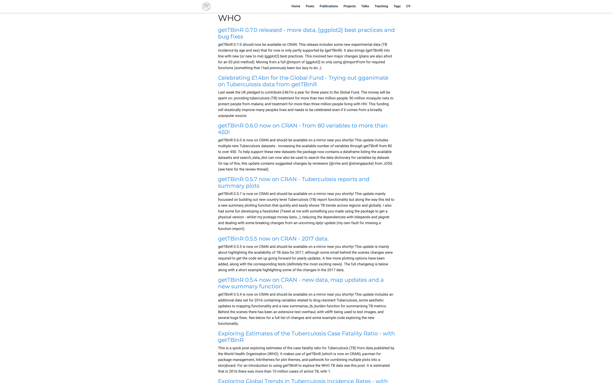

class: inverse
```{r setup, include=FALSE}
options(htmltools.dir.version = FALSE)
```


# Outline

0. Overview

1. Why

2. What

3. How

4. Can I do that?

---
class: center, middle, inverse

# Overview

---
# Overview

---
class: center, middle, inverse

# Why

---

# Why data access packages

---

# Why does Tuberculosis matter


--- 

# Why the addition of tools for working with the data

---
class: center, middle, inverse

# What

---

# World Health Organisation TB data

The WHO provide multiple cleaned datasets via their website. They also have a backend API through which other datasets can be accessed, although these tend to be far from tidy. All analysis ready datasets come with a complete data dictionary.

```{r who-data, fig.height = 3, echo = FALSE}
knitr::include_graphics("img/who-data.png")
```

---

# Getting the WHO TB burden data

Get the WHO TB burden data.
```{r get-tb-data}
tb_burden <- getTBinR::get_tb_burden(verbose = FALSE)

print(tb_burden, n = 3, n_extra = 10)
```
---

# Getting the WHO TB data dictionary

Get the WHO TB data dictionary.

```{r get-dict}
tb_dict <- getTBinR::get_data_dict()

print(tb_dict, n = 3, n_extra = 10)
```

---

# Search for a variable

```{r search-dict}
vars_of_interest <- getTBinR::search_data_dict(var = c("e_inc_100k"),
                                               def = "incidence")
```

---

# Search Result

```{r table-search}
kable(vars_of_interest, "html")
```

---

# Map Global Incidence Rates

```{r map-global-inc, fig.height = 4, dev = 'svg'}
getTBinR::map_tb_burden(metric = "e_inc_100k", verbose = FALSE, interactive = FALSE)
```

---

# Get 10 countries with highest incidence rates in 2016

```{r get-high-inc-countries}
high_inc_countries <- tb_burden %>% 
  filter(year == 2016) %>% 
  group_by(country) %>% 
  summarise(e_inc_100k = max(e_inc_100k)) %>% 
  ungroup %>% 
  arrange(desc(e_inc_100k)) %>% 
  slice(1:10) %>% 
  pull(country) %>% 
  unique
```

---

# 10 countries with highest incidence rates in 2016

```{r high-inc-countries}
high_inc_countries
```

---

# Overview of TB incidence rates

For the countries with the 10 highest incidence rates

```{r plot-tb-inc-overview, fig.height = 4, dev = 'svg'}
getTBinR::plot_tb_burden_overview(metric = "e_inc_100k", countries = high_inc_countries,
                                  verbose = FALSE)
```
---

# Trends over time in TB incidence rates

For the countries with the 10 highest incidence rates

```{r plot-inc--by-country, fig.height = 3, dev = 'svg'}
plot_tb_burden(metric = "e_inc_100k",  
               countries = high_inc_countries,
               facet = "country", scales = "free_y",
               verbose = FALSE)

```

---

# For non R users: Dashboard

`{getTBinR}` has a built in `shiny` dashboard which can be run locally using `getTBinR::run_tb_dashboard()`. 

```{r dashboard-img, echo = FALSE}
knitr::include_graphics("img/ExploreGlobalTB.png")
```
---

# For non R users: Report

`{getTBinR}` has a built in `{rmarkdown}` report which can be used to generate a summary report on country level data (`getTBinR::render_country_report()`). 

```{r dashboard-img, echo = FALSE}
knitr::include_graphics("img/ExploreGlobalTB.png")
```
---

class: center, middle, inverse

# Promotion Promotion Promotion

---

# Blog posts

Multiple case studies that were first released as blog posts<sup>1</sup>, via [Rweekly.org](Rweekly.org), and then adapted into package vignettes.

```{r blog-img, echo = FALSE}

```

.footnote[
[1] See them here: https://www.samabbott.co.uk/tags/who/
]

---

# Gists as code examples<sup>1</sup> 

Gists<sup>1</sup> and `#rstats` twitter<sup>2</sup>.

```{r gists-img, echo = FALSE}
knitr::include_graphics("img/gists.png")
```

.footnote[
[1] Gists: https://gist.github.com/search?utf8=✓&q=getTBinR
]

---

# `#rstats` twitter<sup>1</sup> 

Tweets annoucing new features, tweets show examples of using the package, tweets discussing new package making tools that have been incorporated. Tweeting about whatever you are using the package for - it's very likely that you will find other are interested.

```{r gists-img, echo = FALSE}
knitr::include_graphics("img/gists.png")
```

.footnote[
[1] `{getTBinR}` on Twitter: https://twitter.com/search?q=%23getTBinR&src=hashtag_click
]

---

class: inverse, center, middle

# Thanks for listening

## Slides: http://bit.ly/getTBinR-r-medicine

## Paper: http://bit.ly/getTBinR-paper

## Documentation: http://bit.ly/getTBinR

## Personal Website: http://bit.ly/seabbs

## Tweet at me: [@seabbs](https://twitter.com/seabbs)

---

